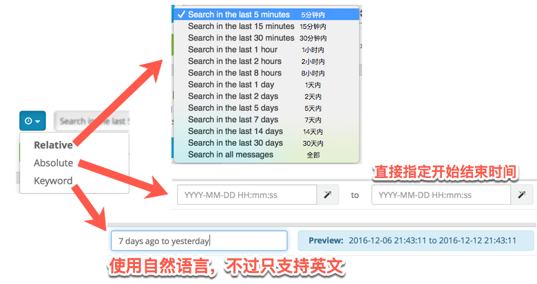

# 6. 日志搜索

这里只介绍了部分最常用的功能，详细文档参考 [Graylog2 的相关章节](http://docs.graylog.org/en/2.1/pages/queries.html)

## 搜索语法

搜索语法类似搜索引擎，但是引入了根据字段搜索的操作符

搜索所有包含 ssh 的日志

    ssh

搜索所有包含 ssh **或** login 的日志

    ssh login

搜索所有精确包含短语 "ssh login" 的日志，使用英文引号

    "ssh login"

搜索所有邮件模块的日志

    module:mail

搜索有 `res_gem_change` 字段的日志

    _exists_:res_gem_change

搜索没有 `res_gem_change` 字段的日志

    _missing_:res_gem_change

### 逻辑操作符

默认多个条件使用空格分开是或的关系，也可以显式地使用 OR，使用 AND 连接条件是与的关系，使用 NOT 是返回所有不满足指定条件的日志。使用括号可以改变结合的优先级。

    ("ssh login" AND (source:example.org OR source:another.example.org)) OR _exists_:always_find_me

上面例子返回『包含短语 "ssh login" 并且主机名是 example.org 或者 another.example.org』的日志，或者是『有字段 `always_find_me` 的日志』

AND, OR, NOT 都必须是全大写的英文字母。

### 通配符

使用 `*` 可以匹配 0 到任意个字符，比如

    soruce:cc*-xy

可以匹配 source 是 `cc-xy`, `cc1-xy` 和 `cc10-xy` 的日志。

使用 `?` 可以匹配任意 1 个字符，比如

    source:cc?-xy

在上面三个例子中只会匹配 `cc1-xy`

### 数字比较

只能用于数字类型的字段

区间，中括号 `[` 和 `]` 是包含边界的，花括号 `{` 和 `}` 是不包含边界的。

    res_gem_change:[100, 200]
    res_gem_change:{100, 200}
    res_gem_change:[100, 200}
    res_gem_change:{100, 200]

也可以只指定单边的范围

    res_gem_change:>0
    res_gem_change:>=0
    res_gem_change:<0
    res_gem_change:<=0

多个条件可以用逻辑操作符组合

    res_gem_change:(>0 AND <100)

### 转义

以下特殊字符必须在之前添加 `\` 进行转义

    & | : \ / + - ! ( ) { } [ ] ^ " ~ * ?

### 时间范围

时间范围有三种方式指定，只是查看最近的记录可以使用 Relative，想要精确查看某个时间段的可以使用 Absolute 来指定。

